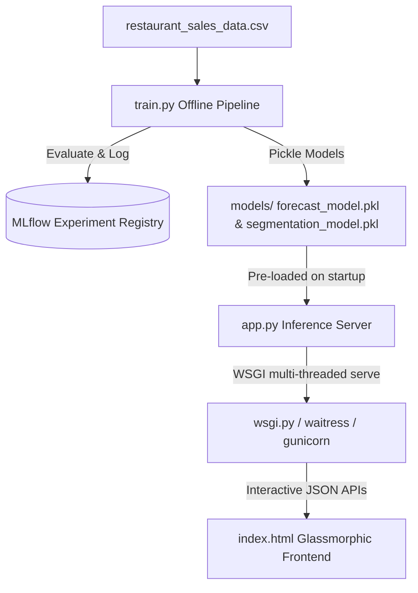

# Technical Specification & MLOps Operations Manual: Restaurant Sales Portal

This document provides a comprehensive technical specification, architectural review, and operations guide for the **GustoAnalytics Restaurant Sales Portal**.

---

## 1. Executive Summary

The Restaurant Sales Portal has been upgraded from a static, single-page dashboard into a production-grade, data-science-driven MLOps application. The system leverages:
- **Predictive Time-Series Forecasting** (Linear Regression) to project weekly sales with 95% confidence intervals.
- **Unsupervised Machine Learning** (K-Means Clustering) to group orders into customer personas.
- **Product Association Rules** (Market Basket Analysis) to suggest bundling deals.
- **Portfolio Management Analysis** (BCG Matrix) to categorize menu item performance.
- **What-If Predictive Simulation** to estimate business changes before executing them.

Under the hood, the application is structured as a decoupled **MLOps pipeline**, separating offline training (`train.py`) from real-time API serving (`app.py`), containerized using **Docker**, and continuously validated via **GitHub Actions CI**.

---

## 2. System Architecture & Data Flow



### Component Breakdown
| Layer | Technology | Version / Standard | Purpose |
| :--- | :--- | :--- | :--- |
| **Backend Framework** | Flask | `3.0.3` | Handles template routing and hosts REST APIs |
| **Machine Learning** | Scikit-Learn | `1.0.0+` | Powers Linear Regression and K-Means Clustering |
| **Data Engineering** | Pandas & NumPy | Core libraries | Handles data cleaning, aggregation, and matrices |
| **Frontend UI** | HTML5 / CSS3 / ES6 JS | Vanilla | Implements modern glassmorphic tabs and navigation |
| **Visualization** | ApexCharts | CDN | Renders animated time-series, scatter, and bubble charts |
| **WSGI Server** | Waitress / Gunicorn | Production std | Servers multi-threaded requests (Waitress for Win, Gunicorn for Linux/Docker) |
| **CI/CD** | GitHub Actions | YAML workflow | Auto-lints, auto-trains, and auto-tests routes on push |

---

## 3. Data Schema & Synthetic Database

The local transaction records are saved at:
`d:/Top Mentor/projects/resturant/restaurant_sales_data.csv`

The database contains sales records generated with weekly seasonality (weekends generating ~1.5x traffic), growth trends, item co-purchase probabilities, and customer profile behaviors:

| Column | Data Type | Description |
| :--- | :--- | :--- |
| **Transaction_ID** | String | Unique line identifier (e.g. `TXN-1001` onwards) |
| **Order_ID** | String | Basket grouping identifier; multiple rows share an `Order_ID` |
| **Date** | Date | Sales date over a rolling 30-day window (`YYYY-MM-DD`) |
| **Time_Of_Day** | String | Meal session (`Lunch`, `Dinner`, `Snack`) |
| **Item_Name** | String | Menu product (e.g. Pizza, Burger, Pasta, Soda, Cake) |
| **Category** | String | Classification group (`Mains`, `Appetizers`, `Desserts`, `Beverages`) |
| **Quantity** | Integer | Quantity of item purchased ($[1, 4]$) |
| **Unit_Price** | Float | Fixed cost per item |
| **Total_Amount** | Float | Invoice cost ($\text{Quantity} \times \text{Unit\_Price}$) |
| **Payment_Method** | String | Settlement method (`Cash`, `Credit Card`, `Mobile Wallet`) |
| **Rating** | Integer | Order rating score ($[3, 5]$ stars) |

---

## 4. Data Science & Machine Learning Pipelines

The core predictive models are decoupled into an offline training pipeline (`train.py`) and a real-time serving server (`app.py`).

### A. Sales Forecasting (Time-Series)
- **Model**: Linear Regression ($y = \beta_0 + \beta_1 \cdot \text{trend} + \beta_2 \cdot \text{is\_weekend}$)
- **Features**:
  - `Trend`: Continuous day index ($0, 1, 2, ..., N-1$) representing business growth.
  - `Is_Weekend`: Indicator variable ($1$ if Friday/Saturday/Sunday, $0$ otherwise) representing weekly cycles.
- **Confidence Interval**: Calculated using residual standard deviation:
  $$\text{Bounds} = \text{Prediction} \pm 1.96 \times \sigma_{\text{residuals}}$$
- **Serving**: Loaded from `models/forecast_model.pkl` to project the next 7 days without training overhead.

### B. Customer Segmentation (K-Means Clustering)
- **Model**: K-Means clustering ($k=4$, standard normalized).
- **Features**: Order-level aggregations of `Total_Amount`, `Quantity`, `Rating`, and `Time_Of_Day` (encoded as Lunch=0, Snack=1, Dinner=2).
- **Centroid Persona Mapping**: Centroids are sorted by average spending to map cluster labels deterministically to personas:
  - **Quick Bite Snackers**: Low quantity, low spend, snack session.
  - **Lunch Rushers**: Medium quantity, medium spend, lunch session.
  - **Dessert Enthusiasts**: High rating, dessert category, evening/night.
  - **The Feast Group**: High quantity, high spend, dinner session.

### C. Menu Optimizer (BCG Matrix & Market Basket Analysis)
- **BCG Portfolio Quadrants**: Menu items are classified based on total sales volume and total revenue relative to median performance:
  - **Star** (High sales, high revenue): Prominent placement. Keep quality high.
  - **Cash Cow** (Low sales, high revenue): Premium margin. Promote to boost volume.
  - **Volume Driver** (High sales, low revenue): Popular but low margin. Consider pricing adjustments.
  - **Underperformer** (Low sales, low revenue): Redesign recipe or bundle with high-performers.
- **Market Basket Analysis**: Calculates Association Rules between items ordered within the same `Order_ID`:
  $$\text{Support}(A, B) = \frac{\text{Count}(A \cap B)}{N}$$
  $$\text{Confidence}(A \rightarrow B) = \frac{\text{Count}(A \cap B)}{\text{Count}(A)}$$
  $$\text{Lift}(A, B) = \frac{\text{Support}(A, B)}{\text{Support}(A) \times \text{Support}(B)}$$

### D. What-If Business Simulator
- **Simulation**: Allows interactive simulation of pricing shifts, dinner session traffic boosts, and service quality ratings on the active database.
- **Serving**: Uses algebraic projection to estimate monthly revenue shifts and satisfaction ratings instantly.

---

## 5. MLOps Deployment System

The application is structured for standard MLOps workflows:

### 1. Model Tracking (MLflow)
The pipeline is instrumented to detect MLflow. When run, it logs:
- **Hyperparameters**: `kmeans_clusters`, `forecast_days`.
- **Metrics**: Forecast R² score, forecast standard error, K-Means inertia.
- **Artifacts**: Serialized model binaries.

### 2. Containerization (Docker)
The `Dockerfile` is optimized using multi-layer caching:
- Bakes pre-trained models during image build step (`RUN python train.py`).
- Deploys Flask inside container using `gunicorn` with 4 worker threads.
- Exposes port 5002.

### 3. Production Serving (WSGI)
- Local environments run **Waitress** (a multi-threaded production WSGI server for Windows hosts).
- Containers run **Gunicorn** (production WSGI server for Linux hosts).

### 4. CI/CD Pipeline (GitHub Actions)
Defined in `.github/workflows/mlops.yml` to run on code push:
- Installs requirements.
- Runs `train.py` to confirm the training pipeline is error-free.
- Verifies model binaries (`models/*.pkl`) are successfully created.
- Runs integration route tests using the Flask test client.

---

## 6. Operation & Execution Guide

### Local Environment Setup

1. **Install requirements**:
   ```bash
   pip install -r requirements.txt
   ```
2. **Execute training pipeline**:
   ```bash
   python train.py
   ```
3. **Launch Production Server (Waitress)**:
   ```bash
   python run_production.py
   ```
4. **Access the Portal**:
   Open browser at: [http://127.0.0.1:5002](http://127.0.0.1:5002)

### Containerized Environment (Docker)

1. **Build Docker Image** (Trains models during build):
   ```bash
   docker build -t restaurant-sales-portal .
   ```
2. **Run Docker Container**:
   ```bash
   docker run -p 5002:5002 restaurant-sales-portal
   ```
3. **Access the Portal**:
   Open browser at: [http://127.0.0.1:5002](http://127.0.0.1:5002)
